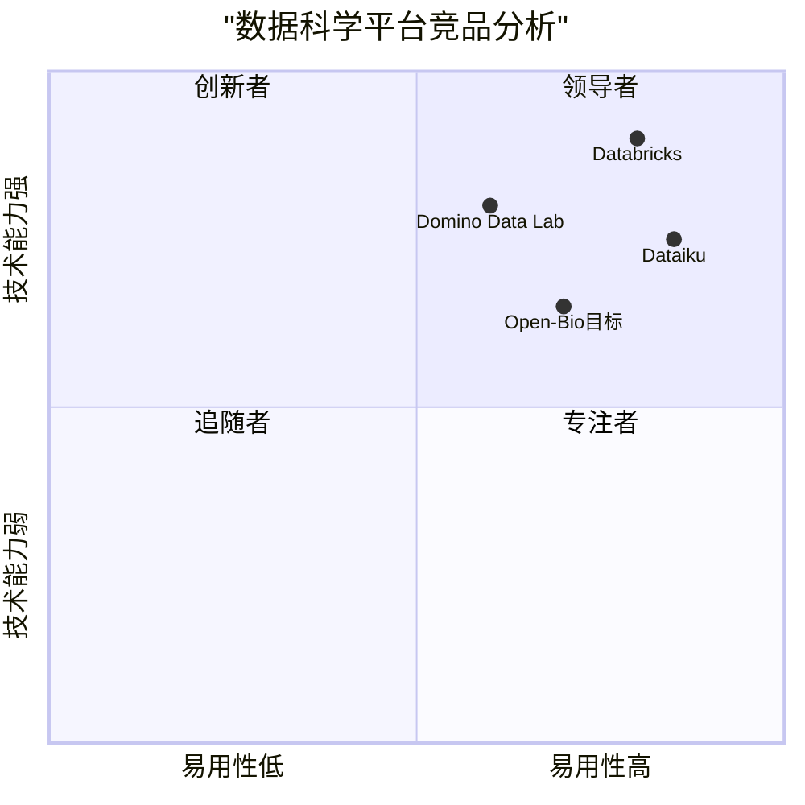

# Open-Bio 数据科学平台 PRD

## 1. 项目概述

### 1.1 项目背景

Open-Bio是一个面向生物信息学和数据科学领域的综合性分析平台，旨在提供可扩展的工具系统、流程系统和文件管理系统，支持研究人员高效进行数据分析工作。

### 1.2 市场现状

- 数据科学平台市场规模预计2024年达到133-155亿美元
- 年复合增长率(CAGR)为20.4%-28.7%
- 预计到2032-2034年市场规模将达到675-995亿美元
- 北美占据27-28%的市场份额

### 1.3 产品目标

1. 打造一站式生物数据分析工作平台
2. 降低数据科学工具使用门槛
3. 提供灵活可扩展的分析流程管理

## 2. 市场分析

### 2.1 市场趋势

1. 技术集成趋势
   - AI和机器学习能力日益重要
   - 云计算平台深度集成
   - 自动化机器学习流程普及

2. 应用领域拓展
   - 医疗健康：临床试验数据分析
   - 金融领域：风险管理和欺诈检测
   - 营销领域：客户行为分析

3. 市场驱动因素
   - 物联网和社交媒体数据激增
   - 数据驱动决策需求增长
   - 预测性分析需求提升
   - 数据合规要求加强

### 2.2 竞品分析

#### 竞品优劣势分析

1. Databricks
   - 优势：
     - 强大的Spark处理能力
     - 自动化机器学习
     - 云原生部署
   - 劣势：
     - 价格较高
     - 学习曲线陡峭

2. Dataiku
   - 优势：
     - 协作环境完善
     - 用户友好
     - 可视化工作流
   - 劣势：
     - 大规模处理能力有限
     - 高级功能定制受限

3. Domino Data Lab
   - 优势：
     - 模型管理完善
     - 生态系统开放
     - 支持本地部署
   - 劣势：
     - 市场占有率较低
     - 产品功能过于复杂

## 3. 用户画像

### 3.1 核心用户群体

1. 数据科学家
   - 需求特点：
     - 高级分析工具
     - Python/R语言支持
     - 机器学习工作流
     - 模型部署能力
   - 使用场景：
     - 数据分析和建模
     - 算法开发和优化
     - 研究成果复现

2. 研究分析师
   - 需求特点：
     - 直观的界面操作
     - 数据可视化
     - 报告生成功能
   - 使用场景：
     - 数据探索分析
     - 研究报告制作
     - 结果展示汇报

3. 团队管理者
   - 需求特点：
     - 项目管理功能
     - 资源分配控制
     - 成果共享协作
   - 使用场景：
     - 团队协作管理
     - 资源调度分配
     - 项目进度监控

## 4. 功能需求

### 4.1 系统架构

1. 前端架构(React)
   - P0：用户认证界面
   - P0：租户管理面板
   - P0：ReactFlow流程编辑器
   - P0：工具参数配置界面
   - P0：结果展示与文件浏览器
   - P1：可视化工具集成
   - P2：AI推荐系统界面

2. 后端架构(FastAPI)
   - P0：认证服务
   - P0：租户服务
   - P0：工具编排器
   - P0：工作流引擎
   - P0：文件管理器
   - P1：工具发现服务
   - P2：AI推荐引擎

### 4.2 工具系统

1. 工具注册机制
   - P0：标准化工具配置
   - P0：工具元信息管理
   - P0：版本控制
   - P1：自动发现服务

2. 工具运行环境
   - P0：容器化执行环境
   - P0：资源限制控制
   - P1：GPU支持
   - P2：分布式计算

### 4.3 流程系统

1. 流程编辑器
   - P0：DAG可视化编辑
   - P0：节点参数配置
   - P0：数据流向定义
   - P1：模板管理
   - P2：版本控制

2. 流程执行引擎
   - P0：任务编排调度
   - P0：状态管理
   - P0：错误处理
   - P1：并行执行优化
   - P2：断点续传

### 4.4 文件管理系统

1. 存储管理
   - P0：文件上传下载
   - P0：目录结构管理
   - P0：权限控制
   - P1：文件预览
   - P2：版本控制

2. 数据集管理
   - P0：基本元信息
   - P0：格式验证
   - P1：数据预处理
   - P2：数据关联分析

### 4.5 AI推荐系统（预研）

1. 数据分析
   - P1：数据特征提取
   - P1：数据质量评估
   - P2：自动化报告

2. 工具推荐
   - P1：基于数据特征推荐
   - P1：基于历史使用推荐
   - P2：个性化优化

## 5. 非功能需求

### 5.1 性能需求

- 页面响应时间 < 2秒
- 工具启动时间 < 30秒
- 支持单机10个以上并发任务
- 文件上传支持最大1GB

### 5.2 安全需求

- 数据传输加密（HTTPS）
- 细粒度访问控制（RBAC）
- 租户数据隔离
- 操作日志审计

### 5.3 可用性需求

- 系统可用性 > 99.9%
- 数据备份策略
- 故障自动恢复
- 完整监控告警

## 6. 项目规划

### 6.1 MVP阶段（10周）

1. 第1-2周：环境搭建
   - 基础设施部署
   - 开发环境配置

2. 第3-4周：用户系统
   - 认证功能
   - 租户管理

3. 第5周：工具系统
   - 工具注册
   - 运行环境

4. 第6周：文件系统
   - 存储管理
   - 权限控制

5. 第7周：工作流系统
   - 流程编辑器
   - 执行引擎

6. 第8周：MVP测试
   - 功能测试
   - 性能测试

7. 第9-10周：AI推荐
   - PoC开发
   - 效果评估

### 6.2 验收标准

1. 功能验收
   - 所有P0功能可用
   - 核心流程跑通
   - 无阻塞性bug

2. 性能验收
   - 满足性能指标
   - 稳定性达标
   - 资源占用合理

3. 安全验收
   - 通过安全扫描
   - 权限隔离有效
   - 数据安全保障

## 7. 风险与考虑

### 7.1 技术风险

- 工具容器化兼容性
- 大规模数据处理性能
- AI推荐系统效果

### 7.2 项目风险

- 研发周期延长
- 资源投入超预期
- 用户接受度不确定

### 7.3 解决方案

- 优先保证核心功能
- 灵活调整开发策略
- 持续收集用户反馈
- 渐进式功能迭代
