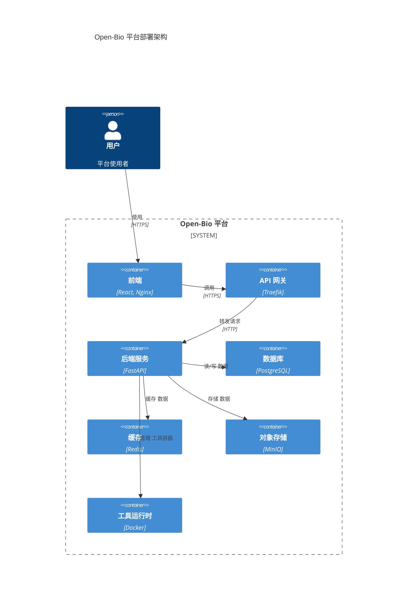

# Open-Bio 平台系统设计

## 实现方法

### 技术栈选择

- 前端：React + TypeScript + Tailwind CSS  
  - 使用 ReactFlow 实现工作流编辑器  
  - 使用 React Query 进行数据获取  
  - 使用 Zustand 进行状态管理  

- 后端：FastAPI + PostgreSQL + Redis  
  - 使用 FastAPI 实现高性能异步 API  
  - 使用 PostgreSQL 管理关系型数据  
  - 使用 Redis 进行缓存和发布/订阅机制  

- 基础设施：  
  - 使用 Docker 和 Kubernetes 进行容器化部署  
  - 使用 MinIO 实现对象存储  
  - 使用 Keycloak 实现身份认证  

### 关键技术挑战

1. 多租户实现  
   - 数据库架构设计需实现租户隔离  
   - 对象存储路径隔离  
   - 资源配额管理  

2. 工具系统架构  
   - 容器沙箱环境  
   - 工具发现机制  
   - 资源限制强制执行  

3. 工作流引擎设计  
   - 有向无环图（DAG）验证与执行  
   - 状态管理与恢复机制  
   - 数据依赖追踪  

4. 文件管理系统  
   - 大文件处理  
   - 文件预览生成  
   - 访问控制机制  

## 常用库与工具

- FastAPI：构建 REST API  
- SQLAlchemy：对象关系映射（ORM）  
- Pydantic：数据校验  
- Alembic：数据库迁移管理  
- Pytest：单元测试框架  
- Docker SDK：容器管理  
- MinIO SDK：对象存储操作  
- Kubernetes Python 客户端：K8s 集群交互  

## 安全性考虑

- 基于 JWT 的身份认证  
- 基于角色的访问控制（RBAC）  
- 数据静态加密  
- 网络隔离机制  
- 容器安全策略  

## 部署架构图

## 性能优化

1. 缓存策略  
   - 使用 Redis 缓存 API 响应  
   - 静态资源启用浏览器缓存  
   - 数据库查询优化  

2. 可扩展性设计  
   - API 服务支持水平扩展  
   - 数据库配置读副本  
   - 对象存储支持分布式部署  

## 监控与日志

1. 指标收集  
   - 使用 Prometheus 收集系统指标  
   - 使用 Grafana 可视化展示  
   - 支持自定义业务指标  

2. 日志系统  
   - 集成 ELK（Elasticsearch + Logstash + Kibana）日志系统  
   - 实现结构化日志  
   - 启用审计追踪机制  
